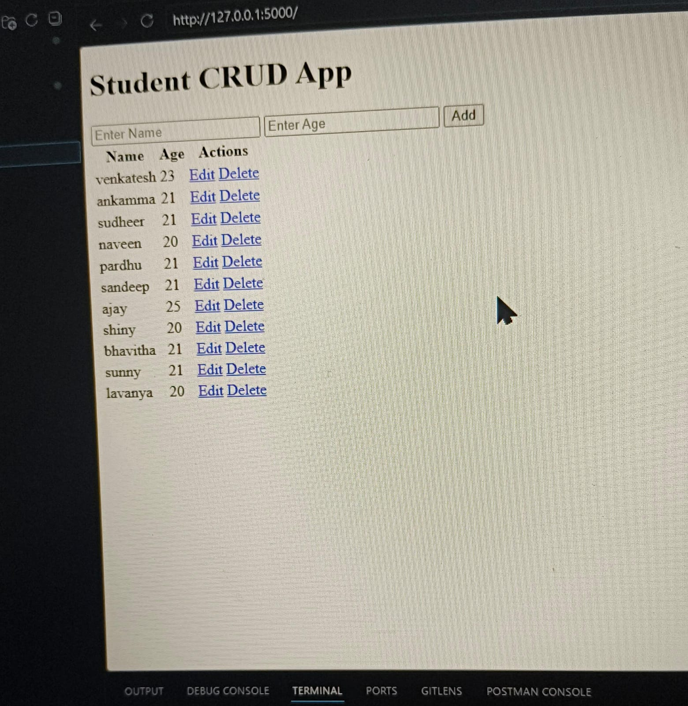

# Flask CRUD Application

A simple CRUD (Create, Read, Update, Delete) application built using Flask and SQLite.

## Features

- Add records
- View records
- Update records
- Delete records

## Technologies Used

- Python
- Flask
- SQLite

## Project Structure

```text
crud project/
│
├── app.py
├── db.py
├── models.py
├── templates/
├── screenshots/
└── README.md
```

## Output

